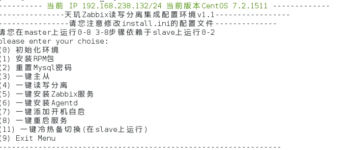
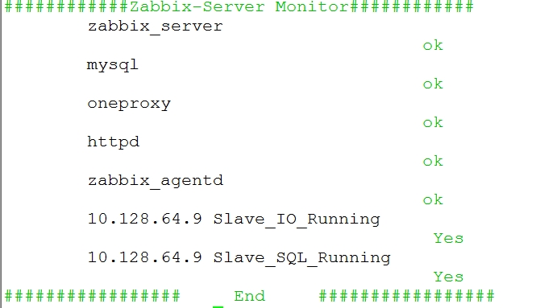
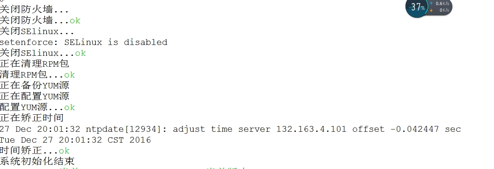
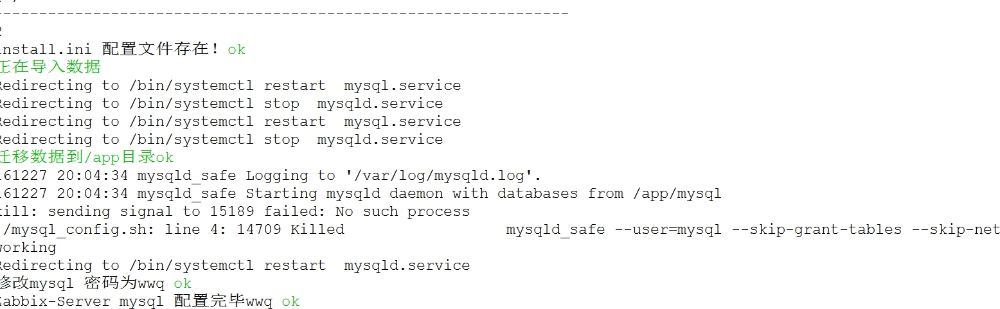

# zabbix
##### zabbix_py_api    高一级zabbix_api接口封装，包含自动注册/查询等 传入参数可供其他devops调用，比他原生接口更方便
##### zabbix openstack 里面是zabbix采集openstack cpu 内存套件之一
##### zabbix onekey  包含zabbix 一键功能，包含自动配置主从 自动冷热切换
##### 高可用方案说明

  -	Zabbix Server节点之间文件做相互同步
  -	MySQL数据库做主从复制
  -	由MySQL Proxy 统一代理MySQL Master和Slave节点, 对外部应用提供接口
  -	MySQL Proxy实现应用层的读写分离

##### 方案优点
  + 前后端通过Proxy分离,架构解耦
  + 快速实现负载均衡、无缝迁移、分布式扩展等
  + Server节点可更具监控需求实现横向扩展
  + 数据库通过Proxy实现多节点高可用
  + 通过数据库Proxy实现应用层的读写分离,提高数据库处理性能
  
  
  
  
  
  
